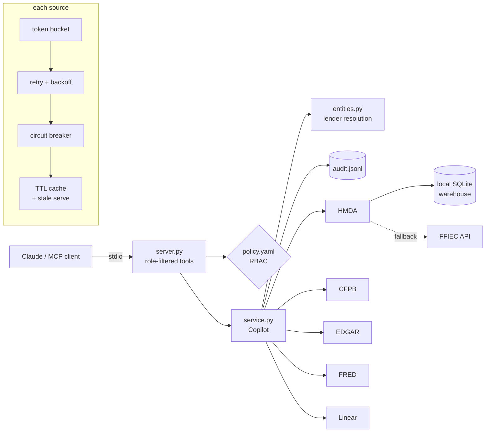

# Lending Risk Copilot (MCP server)

An MCP server that lets Claude act like a junior analyst on a bank's compliance or risk team. It pulls together mortgage lending data, consumer complaints and SEC filings for a lender, puts them side by side, and opens a review ticket when something looks off.

Everything it reads is public data. Everything about *how* it reads it (auth, rate limits, access control, sources going down) is built the way you'd have to build it inside a real bank.

```
You:    How's Wells Fargo looking on mortgages lately? Anything I should flag?

Claude: [calls lender_risk_brief("Wells Fargo")]
        HMDA 2023: denial rate X% on Y decisioned applications ...
        CFPB: mortgage complaints in September were 1.7x the trailing
        5-month average (spike flag set) ...
        10-K Risk Factors mention servicing and regulatory exposure: "..."
        Note: these come from different legal entities: HMDA is the bank
        (Wells Fargo Bank, N.A.), SEC is the holding company.

You:    Open a ticket for that complaint spike.

Claude: [calls create_review_ticket(...)] -> RISK-42
```
*(Illustrative. Run it yourself to see real numbers.)*

---

## Why I built this

I've spent the last couple of years building document AI and LLM pipelines for mortgage clients. The thing that always eats the most time isn't the model, it's the plumbing. Every source has its own auth, its own rate limits, its own way of being down, and its own name for the same company.

MCP is the layer where that plumbing now lives when you connect Claude to enterprise data. So I wanted a project where the plumbing *is* the project:

- **3+ real sources** with real auth and real failure modes, not toy APIs returning static JSON
- **one structured source, one unstructured knowledge source, one source that takes actions**
- **access control**, because "every tool for everyone" isn't how this ships at a bank
- **graceful degradation**: one source dying shouldn't kill the answer, and the model should *know* what's missing instead of filling the gap with vibes

## The sources (and why these)

| Source | Type | What it answers | Auth | The real friction |
|---|---|---|---|---|
| **HMDA** (FFIEC) | Structured | How many mortgage applications did this lender approve/deny? | None (API) / local DB | Huge data. I keep a local SQLite warehouse and fall back to the API. Reported under the *bank's* LEI. |
| **CFPB Complaint DB** | Unstructured + structured | What are consumers complaining about, and is it spiking? | None | Elasticsearch-shaped responses, counts cap at 10k, company names don't match anyone else's. Narratives are sensitive. |
| **SEC EDGAR** | Unstructured | What does the company itself say its risks are? | Required User-Agent | 10 req/s fair-access limit, 403s if you skip the UA, and big banks often bury Risk Factors in an exhibit. |
| **FRED** | Structured (context) | What are mortgage rates / delinquencies doing? | API key | Key management, `"."` for missing values. |
| **Linear** | **Action** | Open a review ticket with the evidence attached | API key + team | Writes. Retrying a timed-out write can double-create, so it doesn't. |

The use case they serve together: **a reviewer asks about a lender, gets a cross-source picture with every gap labeled, and can turn it into a tracked review item without leaving the chat.**

## Architecture



A few decisions worth calling out:

- **`server.py` is thin on purpose.** All the logic is in `service.py`, which doesn't know MCP exists. That's what makes it testable, and the same service could sit behind a REST API later.
- **Every tool returns the same envelope:** `status` (`ok | stale | degraded | unavailable`), `data`, `warnings`, `fetched_at`. The server instructions tell Claude to cite only ok/stale sections and to name what's missing.
- **Each source gets its own rate limiter, breaker and cache.** EDGAR being throttled never slows CFPB down.

More detail in [`docs/architecture.md`](docs/architecture.md).

## Access control

Roles live in [`config/policy.yaml`](config/policy.yaml):

| Role | Can do |
|---|---|
| `viewer` | Aggregates only: HMDA, complaint counts/trends, macro |
| `analyst` | + SEC filings, source health |
| `reviewer` | + complaint **narratives**, + **create tickets** |
| `admin` | everything |

It's enforced in two places:

1. **At startup, tools the role can't use are never registered.** A viewer's Claude doesn't see `create_review_ticket` in `tools/list` at all. That's better than a polite "access denied", because the model can't even try.
2. **At call time, every tool re-checks.** Defense in depth, in case registration and policy ever drift.

There's also a **field-level rule**: complaint narratives (consumer-written free text) come back as `[redacted: requires complaints:narratives]` unless you're a reviewer.

Every call is written to `logs/audit.jsonl` with user, role, tool, outcome and latency. Arguments are **hashed**, not stored, so the audit log doesn't turn into a second copy of sensitive queries.

Identity: in stdio mode the MCP client launches one server process per user, so identity comes from `LRC_USER` / `LRC_ROLE` in the launch config. In a hosted deployment you'd swap that for the OAuth identity on the streamable-HTTP transport. More in [`docs/access-control.md`](docs/access-control.md).

## What happens when things break

This is the part I'd want an interviewer to poke at. Short version:

| Failure | What the server does | What Claude sees |
|---|---|---|
| EDGAR 429 (rate limited) | Honors `Retry-After`, backs off with jitter, up to 3 retries | `ok` if it recovers, else `stale` from cache or `unavailable` |
| CFPB 5xx / timeout | Retries, then serves the last good response from cache | `status: stale` + "served from cache: HTTP 503..." |
| Any source fails 3x in a row | Circuit opens for 30s, calls fail fast (no 20s timeouts) | `unavailable` / `stale`, `source_health` shows `breaker: open` |
| Bad/missing API key (401/403) | **Not retried** (that just burns quota), doesn't trip the breaker | `unavailable` + "credentials missing or rejected" |
| FRED key not set | Tool still works, section reports not configured | `unavailable` + "set FRED_API_KEY" |
| EDGAR Risk Factors not in the primary doc | Returns the filing index link | `degraded` + "probably in an exhibit (EX-13)" |
| Lender is private (no SEC filings) | Filing section skipped | `unavailable` + "no SEC CIK (private lender?)" |
| Linear down / times out | **Doesn't retry** (might already have been created). Returns the drafted ticket | `degraded`, `created: false`, full draft to paste |
| One source dies mid-brief | Other sections still return (they run in parallel, isolated) | `status: degraded`, `coverage` map shows exactly which |

Full matrix in [`docs/failure-modes.md`](docs/failure-modes.md).

## The unglamorous hard part: one lender, three names

| | Identity | Example |
|---|---|---|
| HMDA | bank subsidiary's **LEI** | Wells Fargo Bank, National Association |
| CFPB | CFPB's company string | WELLS FARGO & COMPANY |
| EDGAR | holding company's **CIK** | WELLS FARGO & COMPANY/MN (72971) |

`entities.py` handles this with a seed registry (`data/lender_registry.yaml`), runtime lookups (the HMDA filer list, CFPB's company suggest, SEC's ticker file) and fuzzy matching. Every identifier comes back with **how** it was resolved and a **confidence** score. The server instructions tell Claude to confirm with the user when confidence is below 0.8, because a confidently wrong LEI produces confidently wrong numbers.

`scripts/verify_registry.py` checks every pinned value against the live sources, because registries rot.

## Running it

```bash
git clone https://github.com/sidd9923/lending-risk-mcp && cd lending-risk-mcp
python -m venv .venv && source .venv/bin/activate
pip install -e ".[dev]"
cp .env.example .env      # fill in SEC_USER_AGENT at minimum
```

| Variable | Needed for | Get it |
|---|---|---|
| `SEC_USER_AGENT` | EDGAR | Just `"Your Name you@email.com"` |
| `FRED_API_KEY` | macro context | free at fred.stlouisfed.org |
| `LINEAR_API_KEY`, `LINEAR_TEAM_ID` | tickets | Linear → Settings → API (free plan works) |
| `LRC_ROLE` | access level | `viewer` / `analyst` / `reviewer` / `admin` |

HMDA and CFPB need no keys. Nothing is mandatory: missing keys just make those sections report `unavailable`.

**Optional: load the local HMDA warehouse** (faster, no rate limits, adds top-denial-states):

```bash
python scripts/load_hmda.py --year 2023 --lei <LEI> --lei <LEI>
# or a full snapshot CSV you downloaded:
python scripts/load_hmda.py --csv ~/Downloads/2023_public_lar.csv
```

**Check that the live APIs still look the way the code expects:**

```bash
set -a; source .env; set +a
python scripts/smoke_live.py "Wells Fargo"
python scripts/verify_registry.py
```

**Hook it up to Claude Desktop** (`claude_desktop_config.json`, full example in [`examples/`](examples/claude_desktop_config.json)):

```json
{
  "mcpServers": {
    "lending-risk": {
      "command": "/path/to/lending-risk-mcp/.venv/bin/lending-risk-mcp",
      "env": { "LRC_ROLE": "reviewer", "LRC_USER": "sid", "SEC_USER_AGENT": "Sid sid@example.com" }
    }
  }
}
```

Or with Claude Code: `claude mcp add lending-risk -e LRC_ROLE=analyst -- /path/to/.venv/bin/lending-risk-mcp`

## Tools

| Tool | Permission | What it's for |
|---|---|---|
| `lender_risk_brief` | `lender:resolve` | Start here. Parallel fan-out to every source your role can see. |
| `resolve_lender` | `lender:resolve` | Name → LEI / CFPB company / CIK, with confidence |
| `hmda_summary` | `hmda:read` | Applications and volume by outcome, denial rate |
| `complaint_trend` | `complaints:read` | Monthly counts + spike flag (latest ≥ 1.5× trailing avg) |
| `search_complaints` | `complaints:read` | Recent complaints, full-text search; narratives gated |
| `filing_risk_factors` | `filings:read` | Keyword excerpts from 10-K Item 1A |
| `macro_series` | `macro:read` | FRED series (mortgage rates, delinquencies) |
| `create_review_ticket` | `tickets:create` | Linear issue with evidence; draft fallback |
| `source_health` | `admin:health` | Config + circuit breaker state per source |

## Tests

```bash
pytest          # 50 tests, all HTTP mocked with respx, runs offline in ~5s
ruff check .
```

They cover the stuff that's easy to get wrong: retries vs. auth errors, breaker state transitions, stale-cache serving, the brief degrading when CFPB is down, viewers not seeing write tools over the actual MCP interface, narratives redacted by role, Linear *not* retrying a timed-out write, and EDGAR skipping the table-of-contents "Item 1A" match.

Live API shapes aren't tested in CI (no network, no keys), which is what `scripts/smoke_live.py` is for.

## Layout

```
src/lending_risk_mcp/
  server.py        MCP adapter: role-filtered tool registration, tool docs for the model
  service.py       the actual logic (Copilot): tools, fan-out, audit, error envelope
  access.py        RBAC policy + audit log
  entities.py      lender resolution across HMDA / CFPB / EDGAR
  resilience.py    token bucket, retry/backoff, circuit breaker, TTL cache
  errors.py        error types + SourceResult envelope
  sources/         one adapter per upstream (hmda, cfpb, edgar, fred, linear)
config/policy.yaml roles and permissions
data/              lender registry (+ hmda.sqlite once you load it)
scripts/           warehouse loader, registry verifier, live smoke test
docs/              architecture, failure modes, access control
```

## Known limitations / what I'd do next

- **HMDA lags about a year**, so pairing 2023 HMDA with last month's complaints is a mismatch. The brief says which year it's using, but a real deployment would want the quarterly filer data that regulators see.
- **The spike detector is deliberately dumb** (latest vs trailing mean). Next step is seasonality-aware, plus normalizing complaints by origination volume so big lenders don't always look worse.
- **Cache is in-process.** Multiple users or replicas would want Redis.
- **Identity via env is fine for stdio**, not for hosted. Next is streamable-HTTP + OAuth with roles from the IdP's group claims.
- **EDGAR exhibit parsing**: when Risk Factors live in EX-13, follow the filing index into the exhibit instead of just linking it.
- **An eval set**: 20–30 analyst questions with expected tool calls and grounded answers, to catch regressions in tool descriptions, not just code.

## Data notes

All data is public: HMDA (FFIEC/CFPB), the CFPB Consumer Complaint Database, SEC EDGAR, and FRED. Complaint data reflects consumer-submitted complaints. It isn't verified and isn't a measure of a company's overall conduct. Nothing here is a judgment about any lender; it's a demo of how to wire the data up responsibly.

MIT licensed.
